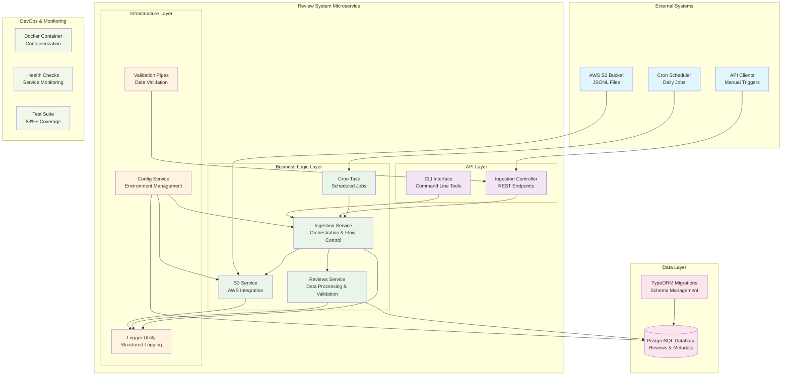
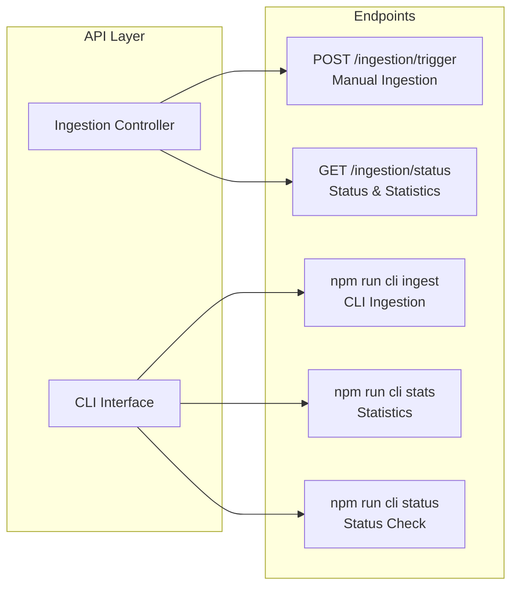
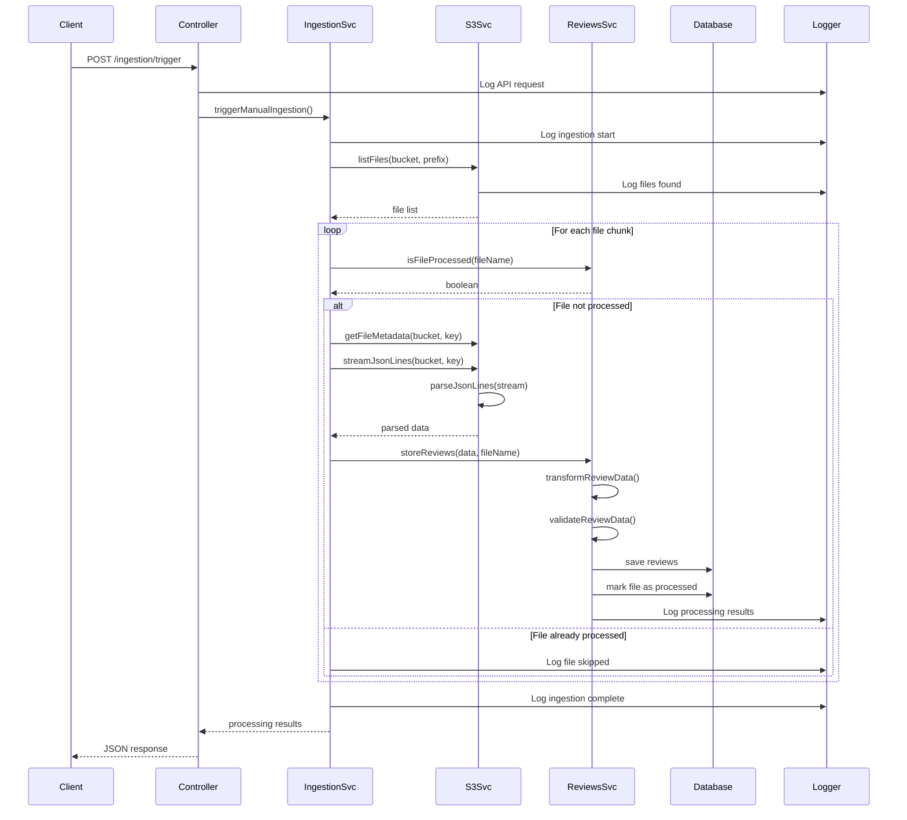
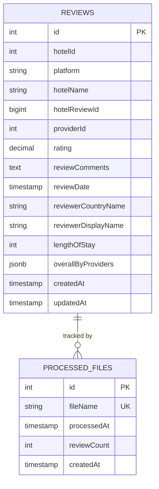
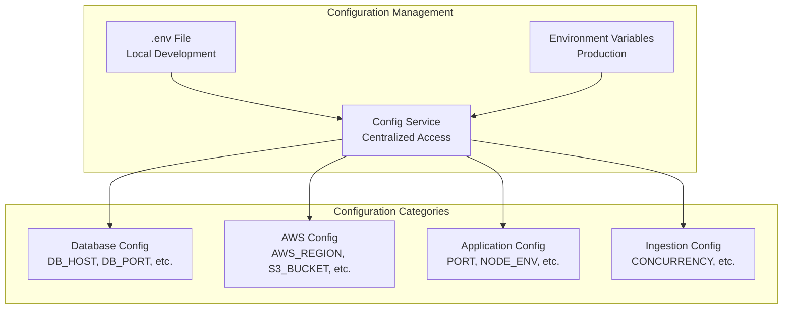
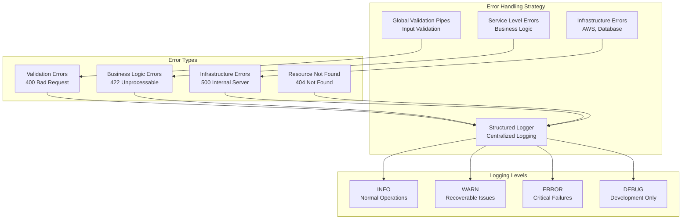
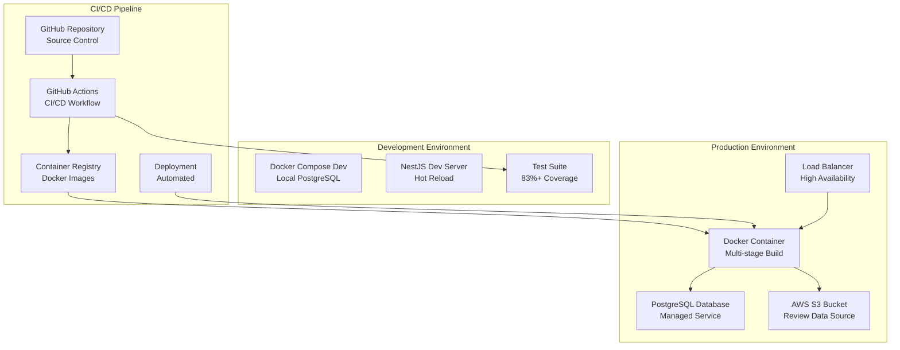

# Review System Microservice - Architecture Diagram

## System Overview

The Review System Microservice is a robust, scalable NestJS application designed to ingest hotel reviews from AWS S3, process and validate the data, and store it in a PostgreSQL database with comprehensive monitoring and automation capabilities.

## High-Level Architecture

## Detailed Component Architecture

### 1. API Layer Components

### 2. Business Logic Layer

```mermaid
graph TB
    subgraph "Business Services"
        IngestionSvc[Ingestion Service<br/>🔄 Orchestration]
        ReviewsSvc[Reviews Service<br/>📝 Data Processing]
        S3Svc[S3 Service<br/>☁️ AWS Integration]
        CronTask[Cron Task<br/>⏰ Scheduling]
    end

    subgraph "Core Functions"
        subgraph "Ingestion Service"
            RunIngestion[runIngestion<br/>Main Process Flow]
            ChunkFiles[chunkArray<br/>Concurrent Processing]
            GetStatus[getIngestionStatus<br/>Status Reporting]
        end

        subgraph "Reviews Service"
            StoreReviews[storeReviews<br/>Data Persistence]
            ValidateData[validateReviewData<br/>Business Rules]
            TransformData[transformReviewData<br/>Data Mapping]
            CheckProcessed[isFileProcessed<br/>Idempotency]
        end

        subgraph "S3 Service"
            ListFiles[listFiles<br/>File Discovery]
            StreamData[streamJsonLines<br/>Data Streaming]
            ParseJSON[parseJsonLines<br/>JSON Processing]
            GetMetadata[getFileMetadata<br/>File Info]
        end
    end

    IngestionSvc --> RunIngestion
    IngestionSvc --> ChunkFiles
    IngestionSvc --> GetStatus

    ReviewsSvc --> StoreReviews
    ReviewsSvc --> ValidateData
    ReviewsSvc --> TransformData
    ReviewsSvc --> CheckProcessed

    S3Svc --> ListFiles
    S3Svc --> StreamData
    S3Svc --> ParseJSON
    S3Svc --> GetMetadata
```

### 3. Data Flow Architecture

### 4. Database Schema Architecture

### 5. Configuration & Environment Architecture

### 6. Error Handling & Logging Architecture

### 7. Deployment Architecture

## Key Architectural Patterns

### 1. **Layered Architecture**
- **API Layer**: Controllers and CLI interfaces
- **Business Logic Layer**: Services with domain logic
- **Infrastructure Layer**: External integrations and utilities
- **Data Layer**: Database entities and repositories

### 2. **Dependency Injection**
- NestJS built-in DI container
- Service-to-service dependencies
- Configuration injection
- Testability through mocking

### 3. **Repository Pattern**
- TypeORM repositories for data access
- Entity-based data modeling
- Migration-based schema management

### 4. **Strategy Pattern**
- Configurable concurrency processing
- Multiple data validation strategies
- Pluggable logging mechanisms

### 5. **Observer Pattern**
- Event-driven logging
- Status monitoring and reporting
- Error notification system

## Scalability Considerations

### Horizontal Scaling
- **Stateless Design**: No session state, enables multiple instances
- **Database Connection Pooling**: Efficient resource utilization
- **Concurrent Processing**: Configurable file processing parallelism
- **Idempotent Operations**: Safe retry mechanisms

### Performance Optimization
- **Streaming Data Processing**: Memory-efficient large file handling
- **Batch Processing**: Chunked file processing for better throughput
- **Database Indexing**: Optimized queries with proper indexes
- **Connection Reuse**: AWS SDK connection pooling

### Monitoring & Observability
- **Structured Logging**: JSON-formatted logs with context
- **Health Checks**: Docker health check endpoints
- **Metrics Collection**: Processing statistics and performance data
- **Error Tracking**: Comprehensive error logging and reporting

## Security Architecture

### Data Security
- **Environment Variables**: Sensitive configuration management
- **Input Validation**: Global validation pipes
- **SQL Injection Prevention**: TypeORM parameterized queries
- **Error Information Leakage**: Sanitized error responses

### Infrastructure Security
- **Non-root Container**: Docker security best practices
- **AWS IAM**: Least privilege access to S3 resources
- **Database Security**: Connection encryption and authentication
- **Network Security**: Container network isolation

This architecture provides a solid foundation for a production-ready microservice with excellent maintainability, scalability, and reliability characteristics.